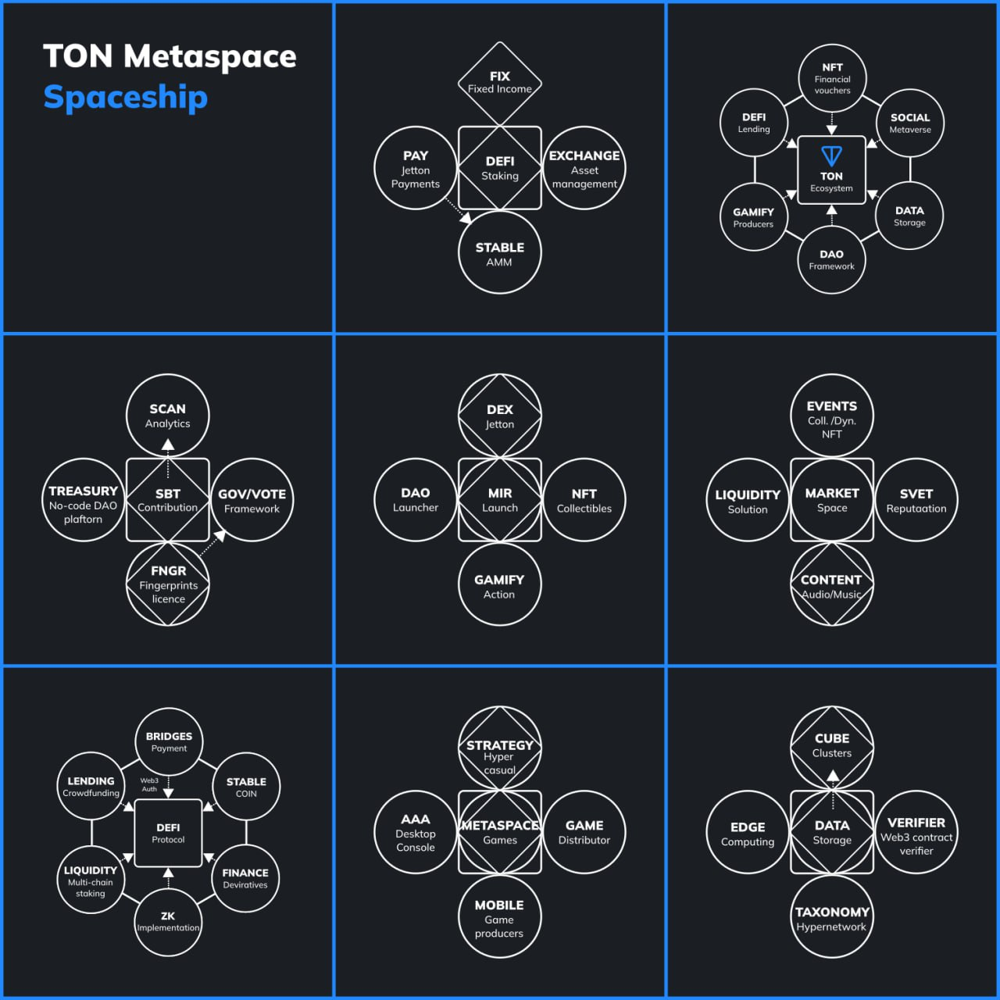

It is necessary that virtual environments are open, accessible and safe for everyone. This is of paramount importance for the appearance of the metaverse in The Open Network.
The term "metaverse" is used to describe augmented reality. This is a signal of a significant change in how people think about the future of online communications. With today's technological advances and the increase in geographically distributed social circles, the idea of seamlessly connected virtual worlds as part of a metaverse has not been more realistic.

[Conferences](https://t.me/toncon) can reach a new audience, and friends can connect to explore interactive spaces.

### 🎨 3D

> If you are a 3D artist and want to support what we are doing with TON Metaspace, consider creating and releasing content under a Creative Commons Zero license or using [NFT TON Fingerprints](https://github.com/mir-one/fingerprints) when creating Metaspace and releasing them as remixed media. We highly appreciate the content with a low number of polygons, optimized for good work on the Internet! In particular, we would like to see scenes that reflect a wide range of experiences.

## It is necessary that virtual environments are open, accessible and safe for everyone. This is of paramount importance for the appearance of the metaverse in The Open Network.

The term "metaverse" is used to describe augmented reality. This is a signal of a significant change in how people think about the future of online communications. With today's technological advances and the increase in geographically distributed social circles, the idea of seamlessly connected virtual worlds as part of a metaverse has not been more realistic.

[Conferences](https://github.com/DAO-TON-CON) can reach a new audience, and friends can connect to explore interactive spaces.

# Milestone 2: design

Some approaches related to the concept of the metaverse and virtual worlds are known through networks, including identification systems, communication protocols, social networks and online economics.

- Build Ecosystem
- Infrastructure Web3 Storage (Market spaces), Costs
- Deploy Assets (3D, nulled scenes, avatars, mp3, jpg) CC0
- Contact, design cards design and tests + host events
- Hackaton builders virtual Scenes on TON,
- Code of Conduct CC0
- Deploy Events Metaspace CC0

Result: 6 main metaspace are ready to accept guests

# Milestone 3: market

The metaverse is already beginning to spread three-dimensional environments (often created and shared by users). The use of digital "avatars" and the introduction of virtual and augmented reality technologies.

- Generator Avatars CC0
- Market avatars
- Market Metaspaces
- Custom Constructor
- Hackaton builders virtual Avatars on TON

Result: avatar constructor works, well known avatars of TON world can be chosen

# Milestone 4: World oracles

The shift in computing paradigms makes it possible to promote open standards and projects that encourage the development of decentralized, distributed and interoperable virtual worlds. At the device level, the Khronos Group's OpenXR standard has been widely adopted by headset manufacturers, which makes it possible to focus on a single API with the capabilities of specific devices supported through extensions.

- TON Connect adding and login method development
- Oracle - Stable Coin rate, 1tx per hour x10 Data Provider CC0
- Introduction system, networking
- Hackaton builders virtual Worlds on TON

Result: Obtaining Governance and Acquiring Management Tools

# Milestone 5: DAOvsSibyl

There are still ongoing debates about how best to reduce risks and strengthen resistance to the Sibyl. Detecting various patterns of attack vectors allows us to create simple but rigorous tools to detect these patterns in a real and potentially high funding environment.

Management in the style of decentralized organizations is used to make decisions and vote on major issues.

- Environment, infrastructure, hardware
  SubDAO - Launcher SubDAO Metaspace, DAO Metaspace
- Hackaton CC0
- Protection from the sibyl's attack - Human / Bot

Result: The DAO is created in a strict time frame t. Deploy new-mulstisig

# Milestone 6: educational course

TON Metaspace supports the creation of training courses and materials, as well as other activities, including those conducted in collaboration with the marketing department in order to attract more people to the TON ecosystem

- professionsVirtual Builder/Moderator Vitrual Worlds
- Tool LOD Support assets / Open standart
- Hackaton textures Advanced Tips, Oprimizing models
- Gamefy (quests. quiz, LMS, City TON, hyper casual0strategy, Distributor, Contributor) CC0

Result: educational quest uploaded to meta and works with open source

# Milestone 7: Staking and DeFi

- Staking (Reality Show - mainstage)
- Displaying data on profitability calculations from Stacking in Metaspaces
- Hackaton De-Fi deployer, Jetton Metaspaces

Result: tokenomic system and staking possibility created and can be used by tonmeta guests

# Milestone 8: Storage providing

Metadata storage platforms provide creators with optimized user interfaces and allow them to store their NFT metadata in decentralized storage solutions such as Arweave, IPFS or Filecoin. TON Storage guarantees almost indefinite data storage, while smart contracts on the blockchain regulate financial incentives. The node operator and the user will be able to create a smart contract in the TON blockchain, which guarantees that the user will pay a fixed amount in TON for storing files for a pre-agreed period of time.

- Storage Provider
- Hackaton Provider TON domain to a TON Storage bag of files
- Oracle verification

Result: prototype of node-cube built, node works. Any user can become a node operator in the TON network and receive a fee from other users for hosting files, even if he works with only one node. In addition, the storage is effectively combined with the service for creating TON Sites and TON DNS sites, allowing you to run TON Metaspace on the TON network without a fixed IP address, a centralized domain or a certified centralized center.

# Milestone 9: NFT

- Fee, mint SBT, NFT CC0 Collections, Fee Storage Providers
- Mint Items Collection, Asset Open Metaverse The Open Network

Result: Deploy NFT collections, with a limited access level. Placing `Assets` collections in TON Storage

# Milestone 10: Contribution

TON Metaspace can provide a level of proof of human existence, using pseudonymous digital biometric identification that can be verified, for grant committees to ensure a fair distribution of funds.

- Contributing systems Metaspace
- Organization of placement and presentation of <50 Pitch Deck projects
- Cost reward system

Result: Organization of an educational model for creating creative remixes and creating derivative works

