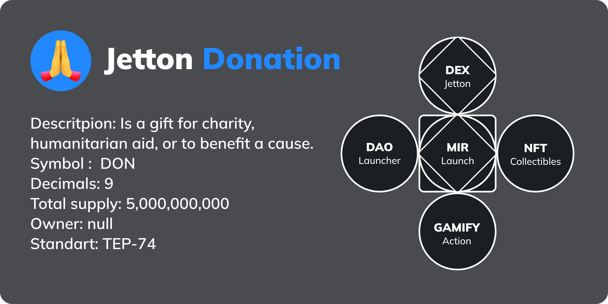
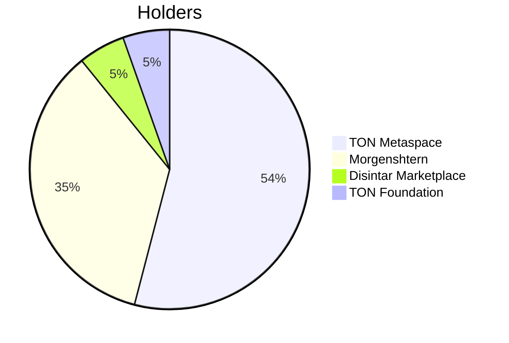

# Donation



Is a gift for charity, humanitarian aid, or to benefit a cause.

| Name         | Donation                                                                                                                      |
| ------------ | ----------------------------------------------------------------------------------------------------------------------------- |
| Symbol       | DON                                                                                                                           |
| Decimals     | 9                                                                                                                             |
| Total supply | 5,000,000,000                                                                                                                 |
| Owner        | null                                                                                                                          |
| Standart     | TEP-74                                                                                                                        |
| Address      | [EQDEcJlTPBymzUqOJ15QR44vIlPIHhsWllrIafWpPdeHiuNR](https://tonverifier.live/EQDEcJlTPBymzUqOJ15QR44vIlPIHhsWllrIafWpPdeHiuNR) |
| Code Hash    | `E/XXoxbG124QU+iKxZtd5loHKjiEUTcdxcW+y7oT9Q4=`                                                                                |
| Compiler     | `func -o output.fif -SPA jetton-minter.fc`                                                                                    |
| Verified on  | 11/15/2022                                                                                                                    |
| TON Assets   | [TON Community jetton Donation](https://github.com/ton-community/ton-assets/blob/main/jettons/donation.yaml)                  |
| Telegram     | [Donation Jetton](https://t.me/donation_jetton)                                                                               |

```json
"EQDEcJlTPBymzUqOJ15QR44vIlPIHhsWllrIafWpPdeHiuNR": {
        name: "Donation",
        ammMinter: "EQCIaJJXSZjOvrchgXXOy90PIS51mMOXMBcmlkUvnIKk9Od5",
        tokenMinter: "EQDEcJlTPBymzUqOJ15QR44vIlPIHhsWllrIafWpPdeHiuNR",
        displayName: "DON",
        image: "https://cache.tonapi.io/imgproxy/FDcUw2JFUphF2irJPrZdQP-Uz9R2urTvJtvjAaXFDNE/rs:fill:200:200:1/g:no/aHR0cHM6Ly9pcGZzLmlvL2lwZnMvYmFma3JlaWhwcW5ramNmd2ZpcGVrZ2o3Z3RwY2hiNmFkbm83czZ5ZGlnb25iaHN2d3hkbWV4NWF3YXU.webp",
        color: "#0061d2",
        decimals: 9,
    },
```

## Verification Proof

| Status   | Public Key                                   | IP            | Verification date | Verifier                                                                           |
| -------- | -------------------------------------------- | ------------- | ----------------- | ---------------------------------------------------------------------------------- |
| Verified | JHMdZoLZNivU2k9kG0pJ5/a8erYIR/nfimKIbQqMj9w= | 12.125.234.77 | 11/15/2022        | [Proof](https://tonverifier.live/EQDEcJlTPBymzUqOJ15QR44vIlPIHhsWllrIafWpPdeHiuNR) |
| Verified | kuJfZpEPqRThW+xCTu92kc/TYRzZcGHCCjiCu/s/8H4= | 12.125.234.77 | 11/15/2022        | [Proof](https://tonverifier.live/EQDEcJlTPBymzUqOJ15QR44vIlPIHhsWllrIafWpPdeHiuNR) |
| Verified | mpdHqLhI5rpbl6T0tG0S7LohGj2IUzoGt7bfrEKSe+Y= | 12.125.234.77 | 11/15/2022        | [Proof](https://tonverifier.live/EQDEcJlTPBymzUqOJ15QR44vIlPIHhsWllrIafWpPdeHiuNR) |

## Motivation

Donation a basic liquid token to encourage developers. Jetton can be obtained in several ways:

a. Buy

b. Receive as a reward for the work done

c. Receive for the development of educational and other TON products

d. Receive as a reward for contributing to the community

e. Airdrop

f. [Metaspace Ambassador DAO](https://tonmetaspace.org/ambassador-program)

## Who uses Donation?

Donation can be used in many situations where someone would normally put their hands together. This can make the conversation more interesting because it's like showing something real with an Jetton.

In Japan and some other Asian countries, when you put your hands together like in the folded hands emoji, it can mean more than just being spiritual. It can also mean asking for something, saying thank you, or apologizing.

`Donating` Jetton can also be a way to say thank you. For example, if someone has really great friends, they might send them Jettons as a way of showing how grateful they are to have them in their life. People can also use Donation to ask for something politely, like when they want their favorite `Virtual Idols` to appear in `Metaspace`. Donation looks like two hands, so it's a good way to show something that's similar to real life.

## Protect yourself and your users

Don't forget that here we are dealing with programmable money. Jettons can be sold and users can end up paying real money for them. Our responsibility as a community is to ensure the safety of everyone.

Never deploy smart contract code that you cannot view

Make sure you understand what you are deploying. We've put a lot of effort into making sure everything is open source. The deployed smart contract code is available in this repository, you should review it and make sure it is compatible with the official standard version. The HTML form that performs the deployment is also open source and served on GitHub pages, so you can be sure that the source you see is what is actually being served. By deploying your Jetton, you take full responsibility for what you deploy. This Jetton is intended for educational purposes only and does not provide any guarantees.

## Administrator Role in Jetton Donation

The Jetton code allows a special administrator role (the wallet address of the deployer) to mint new tokens for themselves and change metadata. This functionality is necessary for the initial launch, because that's how new Jettons come into circulation. After mint is finished, you need to revoke your administrator rights by changing admin to an empty address. In Jetton Donation address: `null`. Revoking the administrator role ensures that no one will ever be able to mint new tokens in the future and lower the Jetton price.

## Assets


Emoji: `🙏`

Color background: `#0088cc`

The emoji where two hands are folded together can mean many different things. Some good things like feeling thankful, connected to a higher power, or having faith in something. But it can also mean asking for help, wishing for something, or really wanting a specific result.

# Allocation



# How create LP TON/JTON/DON

## DEX

**DonationSwap** is a DEX/AMM using the Uniswap V2 curve to create liquidity pairs and allow traders to swap jettons and liquidity providers to supply liquidity and earn rewards.

## Liquidity

- [DON-JTON LP Contract](https://tonscan.org/jetton/EQD6EKBOHIxy3DU6wzFm4FbQNcVEZn0x0t3xIPVNPeDKR-Qz)
- [DON AMM Contract](https://tonverifier.live/EQCIaJJXSZjOvrchgXXOy90PIS51mMOXMBcmlkUvnIKk9Od5)

Add address Donation Jetton `EQDEcJlTPBymzUqOJ15QR44vIlPIHhsWllrIafWpPdeHiuNR`

## Source Code

### jetton-minter.fc

```func
#include "imports/stdlib.fc";
#include "imports/params.fc";
#include "imports/constants.fc";
#include "imports/jetton-utils.fc";
#include "imports/op-codes.fc";
#include "imports/utils.fc";
#pragma version >=0.2.0;

(int, slice, cell, cell) load_data() inline {
  slice ds = get_data().begin_parse();
  return (
      ds~load_coins(), ;; total_supply
      ds~load_msg_addr(), ;; admin_address
      ds~load_ref(), ;; content
      ds~load_ref()  ;; jetton_wallet_code
  );
}

() save_data(int total_supply, slice admin_address, cell content, cell jetton_wallet_code) impure inline {
  set_data(begin_cell()
            .store_coins(total_supply)
            .store_slice(admin_address)
            .store_ref(content)
            .store_ref(jetton_wallet_code)
           .end_cell()
          );
}

() mint_tokens(slice to_address, cell jetton_wallet_code, int amount, cell master_msg) impure {
  cell state_init = calculate_jetton_wallet_state_init(to_address, my_address(), jetton_wallet_code);
  slice to_wallet_address = calculate_jetton_wallet_address(state_init);
  var msg = begin_cell()
    .store_uint(0x18, 6)
    .store_slice(to_wallet_address)
    .store_coins(amount)
    .store_uint(4 + 2 + 1, 1 + 4 + 4 + 64 + 32 + 1 + 1 + 1)
    .store_ref(state_init)
    .store_ref(master_msg);
  send_raw_message(msg.end_cell(), 1); ;; pay transfer fees separately, revert on errors
}

() recv_internal(int msg_value, cell in_msg_full, slice in_msg_body) impure {
    if (in_msg_body.slice_empty?()) { ;; ignore empty messages
        return ();
    }
    slice cs = in_msg_full.begin_parse();
    int flags = cs~load_uint(4);

    if (flags & 1) { ;; ignore all bounced messages
        return ();
    }
    slice sender_address = cs~load_msg_addr();

    int op = in_msg_body~load_uint(32);
    int query_id = in_msg_body~load_uint(64);

    (int total_supply, slice admin_address, cell content, cell jetton_wallet_code) = load_data();

    if (op == op::mint()) {
        throw_unless(73, equal_slices(sender_address, admin_address));
        slice to_address = in_msg_body~load_msg_addr();
        int amount = in_msg_body~load_coins();
        cell master_msg = in_msg_body~load_ref();
        slice master_msg_cs = master_msg.begin_parse();
        master_msg_cs~skip_bits(32 + 64); ;; op + query_id
        int jetton_amount = master_msg_cs~load_coins();
        mint_tokens(to_address, jetton_wallet_code, amount, master_msg);
        save_data(total_supply + jetton_amount, admin_address, content, jetton_wallet_code);
        return ();
    }

    if (op == op::burn_notification()) {
        int jetton_amount = in_msg_body~load_coins();
        slice from_address = in_msg_body~load_msg_addr();
        throw_unless(74,
            equal_slices(calculate_user_jetton_wallet_address(from_address, my_address(), jetton_wallet_code), sender_address)
        );
        save_data(total_supply - jetton_amount, admin_address, content, jetton_wallet_code);
        slice response_address = in_msg_body~load_msg_addr();
        if (response_address.preload_uint(2) != 0) {
          var msg = begin_cell()
            .store_uint(0x10, 6) ;; nobounce - int_msg_info$0 ihr_disabled:Bool bounce:Bool bounced:Bool src:MsgAddress -> 011000
            .store_slice(response_address)
            .store_coins(0)
            .store_uint(0, 1 + 4 + 4 + 64 + 32 + 1 + 1)
            .store_uint(op::excesses(), 32)
            .store_uint(query_id, 64);
          send_raw_message(msg.end_cell(), 2 + 64);
        }
        return ();
    }

    if (op == 3) { ;; change admin
        throw_unless(73, equal_slices(sender_address, admin_address));
        slice new_admin_address = in_msg_body~load_msg_addr();
        save_data(total_supply, new_admin_address, content, jetton_wallet_code);
        return ();
    }

    if (op == 4) { ;; change content, delete this for immutable tokens
        throw_unless(73, equal_slices(sender_address, admin_address));
        save_data(total_supply, admin_address, in_msg_body~load_ref(), jetton_wallet_code);
        return ();
    }

    throw(0xffff);
}

(int, int, slice, cell, cell) get_jetton_data() method_id {
    (int total_supply, slice admin_address, cell content, cell jetton_wallet_code) = load_data();
    return (total_supply, -1, admin_address, content, jetton_wallet_code);
}

slice get_wallet_address(slice owner_address) method_id {
    (int total_supply, slice admin_address, cell content, cell jetton_wallet_code) = load_data();
    return calculate_user_jetton_wallet_address(owner_address, my_address(), jetton_wallet_code);
}
```

### utils.fc

```func
() send_grams(slice address, int amount) impure {
  cell msg = begin_cell()
    .store_uint (0x18, 6)
    .store_slice(address)
    .store_grams(amount)
    .store_uint(0, 107)
    .end_cell();
  send_raw_message(msg, 3);
}
```

### params.fc

```func
nt workchain() asm "0 PUSHINT";

() force_chain(slice addr) impure {
  (int wc, _) = parse_std_addr(addr);
  throw_unless(333, wc == workchain());
}
```

### op-codes.fc

```func
int op::transfer() asm "0xf8a7ea5 PUSHINT";
int op::transfer_notification() asm "0x7362d09c PUSHINT";
int op::internal_transfer() asm "0x178d4519 PUSHINT";
int op::excesses() asm "0xd53276db PUSHINT";
int op::burn() asm "0x595f07bc PUSHINT";
int op::burn_notification() asm "0x7bdd97de PUSHINT";
int op::mint() asm "21 PUSHINT";
```

### jetton-utils.fc

```func
cell pack_jetton_wallet_data(int balance, slice owner_address, slice jetton_master_address, cell jetton_wallet_code) inline {
   return  begin_cell()
            .store_coins(balance)
            .store_slice(owner_address)
            .store_slice(jetton_master_address)
            .store_ref(jetton_wallet_code)
           .end_cell();
}

cell calculate_jetton_wallet_state_init(slice owner_address, slice jetton_master_address, cell jetton_wallet_code) inline {
  return begin_cell()
          .store_uint(0, 2)
          .store_dict(jetton_wallet_code)
          .store_dict(pack_jetton_wallet_data(0, owner_address, jetton_master_address, jetton_wallet_code))
          .store_uint(0, 1)
         .end_cell();
}

slice calculate_jetton_wallet_address(cell state_init) inline {
  return begin_cell().store_uint(4, 3)
                     .store_int(workchain(), 8)
                     .store_uint(cell_hash(state_init), 256)
                     .end_cell()
                     .begin_parse();
}

slice calculate_user_jetton_wallet_address(slice owner_address, slice jetton_master_address, cell jetton_wallet_code) inline {
  return calculate_jetton_wallet_address(calculate_jetton_wallet_state_init(owner_address, jetton_master_address, jetton_wallet_code));
}
```

### constants.fc

```func
;; operations (constant values taken from crc32 on op message in the companion .tlb files and appear during build)
int op::increment() asm "0x37491f2f PUSHINT";
int op::deposit() asm "0x47d54391 PUSHINT";
int op::withdraw() asm "0x41836980 PUSHINT";
int op::transfer_ownership() asm "0x2da38aaf PUSHINT";

;; errors
int error::unknown_op() asm "101 PUSHINT";
int error::access_denied() asm "102 PUSHINT";
int error::insufficient_balance() asm "103 PUSHINT";

;; other
int const::min_tons_for_storage() asm "10000000 PUSHINT"; ;; 0.01 TON
```

### stdlib.fc

```func
;; Standard library for funC
;;

forall X -> tuple cons(X head, tuple tail) asm "CONS";
forall X -> (X, tuple) uncons(tuple list) asm "UNCONS";
forall X -> (tuple, X) list_next(tuple list) asm( -> 1 0) "UNCONS";
forall X -> X car(tuple list) asm "CAR";
tuple cdr(tuple list) asm "CDR";
tuple empty_tuple() asm "NIL";
forall X -> tuple tpush(tuple t, X value) asm "TPUSH";
forall X -> (tuple, ()) ~tpush(tuple t, X value) asm "TPUSH";
forall X -> [X] single(X x) asm "SINGLE";
forall X -> X unsingle([X] t) asm "UNSINGLE";
forall X, Y -> [X, Y] pair(X x, Y y) asm "PAIR";
forall X, Y -> (X, Y) unpair([X, Y] t) asm "UNPAIR";
forall X, Y, Z -> [X, Y, Z] triple(X x, Y y, Z z) asm "TRIPLE";
forall X, Y, Z -> (X, Y, Z) untriple([X, Y, Z] t) asm "UNTRIPLE";
forall X, Y, Z, W -> [X, Y, Z, W] tuple4(X x, Y y, Z z, W w) asm "4 TUPLE";
forall X, Y, Z, W -> (X, Y, Z, W) untuple4([X, Y, Z, W] t) asm "4 UNTUPLE";
forall X -> X first(tuple t) asm "FIRST";
forall X -> X second(tuple t) asm "SECOND";
forall X -> X third(tuple t) asm "THIRD";
forall X -> X fourth(tuple t) asm "3 INDEX";
forall X, Y -> X pair_first([X, Y] p) asm "FIRST";
forall X, Y -> Y pair_second([X, Y] p) asm "SECOND";
forall X, Y, Z -> X triple_first([X, Y, Z] p) asm "FIRST";
forall X, Y, Z -> Y triple_second([X, Y, Z] p) asm "SECOND";
forall X, Y, Z -> Z triple_third([X, Y, Z] p) asm "THIRD";
forall X -> X null() asm "PUSHNULL";
forall X -> (X, ()) ~impure_touch(X x) impure asm "NOP";

int now() asm "NOW";
slice my_address() asm "MYADDR";
[int, cell] get_balance() asm "BALANCE";
int cur_lt() asm "LTIME";
int block_lt() asm "BLOCKLT";

int cell_hash(cell c) asm "HASHCU";
int slice_hash(slice s) asm "HASHSU";
int string_hash(slice s) asm "SHA256U";

int check_signature(int hash, slice signature, int public_key) asm "CHKSIGNU";
int check_data_signature(slice data, slice signature, int public_key) asm "CHKSIGNS";

(int, int, int) compute_data_size(cell c, int max_cells) impure asm "CDATASIZE";
(int, int, int) slice_compute_data_size(slice s, int max_cells) impure asm "SDATASIZE";
(int, int, int, int) compute_data_size?(cell c, int max_cells) asm "CDATASIZEQ NULLSWAPIFNOT2 NULLSWAPIFNOT";
(int, int, int, int) slice_compute_data_size?(cell c, int max_cells) asm "SDATASIZEQ NULLSWAPIFNOT2 NULLSWAPIFNOT";

;; () throw_if(int excno, int cond) impure asm "THROWARGIF";

() dump_stack() impure asm "DUMPSTK";

cell get_data() asm "c4 PUSH";
() set_data(cell c) impure asm "c4 POP";
cont get_c3() impure asm "c3 PUSH";
() set_c3(cont c) impure asm "c3 POP";
cont bless(slice s) impure asm "BLESS";

() accept_message() impure asm "ACCEPT";
() set_gas_limit(int limit) impure asm "SETGASLIMIT";
() commit() impure asm "COMMIT";
() buy_gas(int gram) impure asm "BUYGAS";

int min(int x, int y) asm "MIN";
int max(int x, int y) asm "MAX";
(int, int) minmax(int x, int y) asm "MINMAX";
int abs(int x) asm "ABS";

slice begin_parse(cell c) asm "CTOS";
() end_parse(slice s) impure asm "ENDS";
(slice, cell) load_ref(slice s) asm( -> 1 0) "LDREF";
cell preload_ref(slice s) asm "PLDREF";
;; (slice, int) ~load_int(slice s, int len) asm(s len -> 1 0) "LDIX";
;; (slice, int) ~load_uint(slice s, int len) asm( -> 1 0) "LDUX";
;; int preload_int(slice s, int len) asm "PLDIX";
;; int preload_uint(slice s, int len) asm "PLDUX";
;; (slice, slice) load_bits(slice s, int len) asm(s len -> 1 0) "LDSLICEX";
;; slice preload_bits(slice s, int len) asm "PLDSLICEX";
(slice, int) load_grams(slice s) asm( -> 1 0) "LDGRAMS";
slice skip_bits(slice s, int len) asm "SDSKIPFIRST";
(slice, ()) ~skip_bits(slice s, int len) asm "SDSKIPFIRST";
slice first_bits(slice s, int len) asm "SDCUTFIRST";
slice skip_last_bits(slice s, int len) asm "SDSKIPLAST";
(slice, ()) ~skip_last_bits(slice s, int len) asm "SDSKIPLAST";
slice slice_last(slice s, int len) asm "SDCUTLAST";
(slice, cell) load_dict(slice s) asm( -> 1 0) "LDDICT";
cell preload_dict(slice s) asm "PLDDICT";
slice skip_dict(slice s) asm "SKIPDICT";

(slice, cell) load_maybe_ref(slice s) asm( -> 1 0) "LDOPTREF";
cell preload_maybe_ref(slice s) asm "PLDOPTREF";
builder store_maybe_ref(builder b, cell c) asm(c b) "STOPTREF";

int cell_depth(cell c) asm "CDEPTH";

int slice_refs(slice s) asm "SREFS";
int slice_bits(slice s) asm "SBITS";
(int, int) slice_bits_refs(slice s) asm "SBITREFS";
int slice_empty?(slice s) asm "SEMPTY";
int slice_data_empty?(slice s) asm "SDEMPTY";
int slice_refs_empty?(slice s) asm "SREMPTY";
int slice_depth(slice s) asm "SDEPTH";

int builder_refs(builder b) asm "BREFS";
int builder_bits(builder b) asm "BBITS";
int builder_depth(builder b) asm "BDEPTH";

builder begin_cell() asm "NEWC";
cell end_cell(builder b) asm "ENDC";
builder store_ref(builder b, cell c) asm(c b) "STREF";
;; builder store_uint(builder b, int x, int len) asm(x b len) "STUX";
;; builder store_int(builder b, int x, int len) asm(x b len) "STIX";
builder store_slice(builder b, slice s) asm "STSLICER";
builder store_grams(builder b, int x) asm "STGRAMS";
builder store_dict(builder b, cell c) asm(c b) "STDICT";

(slice, slice) load_msg_addr(slice s) asm( -> 1 0) "LDMSGADDR";
tuple parse_addr(slice s) asm "PARSEMSGADDR";
(int, int) parse_std_addr(slice s) asm "REWRITESTDADDR";
(int, slice) parse_var_addr(slice s) asm "REWRITEVARADDR";

cell idict_set_ref(cell dict, int key_len, int index, cell value) asm(value index dict key_len) "DICTISETREF";
(cell, ()) ~idict_set_ref(cell dict, int key_len, int index, cell value) asm(value index dict key_len) "DICTISETREF";
cell udict_set_ref(cell dict, int key_len, int index, cell value) asm(value index dict key_len) "DICTUSETREF";
(cell, ()) ~udict_set_ref(cell dict, int key_len, int index, cell value) asm(value index dict key_len) "DICTUSETREF";
cell idict_get_ref(cell dict, int key_len, int index) asm(index dict key_len) "DICTIGETOPTREF";
(cell, int) idict_get_ref?(cell dict, int key_len, int index) asm(index dict key_len) "DICTIGETREF";
(cell, int) udict_get_ref?(cell dict, int key_len, int index) asm(index dict key_len) "DICTUGETREF";
(cell, cell) idict_set_get_ref(cell dict, int key_len, int index, cell value) asm(value index dict key_len) "DICTISETGETOPTREF";
(cell, cell) udict_set_get_ref(cell dict, int key_len, int index, cell value) asm(value index dict key_len) "DICTUSETGETOPTREF";
(cell, int) idict_delete?(cell dict, int key_len, int index) asm(index dict key_len) "DICTIDEL";
(cell, int) udict_delete?(cell dict, int key_len, int index) asm(index dict key_len) "DICTUDEL";
(slice, int) idict_get?(cell dict, int key_len, int index) asm(index dict key_len) "DICTIGET" "NULLSWAPIFNOT";
(slice, int) udict_get?(cell dict, int key_len, int index) asm(index dict key_len) "DICTUGET" "NULLSWAPIFNOT";
(cell, slice, int) idict_delete_get?(cell dict, int key_len, int index) asm(index dict key_len) "DICTIDELGET" "NULLSWAPIFNOT";
(cell, slice, int) udict_delete_get?(cell dict, int key_len, int index) asm(index dict key_len) "DICTUDELGET" "NULLSWAPIFNOT";
(cell, (slice, int)) ~idict_delete_get?(cell dict, int key_len, int index) asm(index dict key_len) "DICTIDELGET" "NULLSWAPIFNOT";
(cell, (slice, int)) ~udict_delete_get?(cell dict, int key_len, int index) asm(index dict key_len) "DICTUDELGET" "NULLSWAPIFNOT";
cell udict_set(cell dict, int key_len, int index, slice value) asm(value index dict key_len) "DICTUSET";
(cell, ()) ~udict_set(cell dict, int key_len, int index, slice value) asm(value index dict key_len) "DICTUSET";
cell idict_set(cell dict, int key_len, int index, slice value) asm(value index dict key_len) "DICTISET";
(cell, ()) ~idict_set(cell dict, int key_len, int index, slice value) asm(value index dict key_len) "DICTISET";
cell dict_set(cell dict, int key_len, slice index, slice value) asm(value index dict key_len) "DICTSET";
(cell, ()) ~dict_set(cell dict, int key_len, slice index, slice value) asm(value index dict key_len) "DICTSET";
(cell, int) udict_add?(cell dict, int key_len, int index, slice value) asm(value index dict key_len) "DICTUADD";
(cell, int) udict_replace?(cell dict, int key_len, int index, slice value) asm(value index dict key_len) "DICTUREPLACE";
(cell, int) idict_add?(cell dict, int key_len, int index, slice value) asm(value index dict key_len) "DICTIADD";
(cell, int) idict_replace?(cell dict, int key_len, int index, slice value) asm(value index dict key_len) "DICTIREPLACE";
cell udict_set_builder(cell dict, int key_len, int index, builder value) asm(value index dict key_len) "DICTUSETB";
(cell, ()) ~udict_set_builder(cell dict, int key_len, int index, builder value) asm(value index dict key_len) "DICTUSETB";
cell idict_set_builder(cell dict, int key_len, int index, builder value) asm(value index dict key_len) "DICTISETB";
(cell, ()) ~idict_set_builder(cell dict, int key_len, int index, builder value) asm(value index dict key_len) "DICTISETB";
cell dict_set_builder(cell dict, int key_len, slice index, builder value) asm(value index dict key_len) "DICTSETB";
(cell, ()) ~dict_set_builder(cell dict, int key_len, slice index, builder value) asm(value index dict key_len) "DICTSETB";
(cell, int) udict_add_builder?(cell dict, int key_len, int index, builder value) asm(value index dict key_len) "DICTUADDB";
(cell, int) udict_replace_builder?(cell dict, int key_len, int index, builder value) asm(value index dict key_len) "DICTUREPLACEB";
(cell, int) idict_add_builder?(cell dict, int key_len, int index, builder value) asm(value index dict key_len) "DICTIADDB";
(cell, int) idict_replace_builder?(cell dict, int key_len, int index, builder value) asm(value index dict key_len) "DICTIREPLACEB";
(cell, int, slice, int) udict_delete_get_min(cell dict, int key_len) asm(-> 0 2 1 3) "DICTUREMMIN" "NULLSWAPIFNOT2";
(cell, (int, slice, int)) ~udict::delete_get_min(cell dict, int key_len) asm(-> 0 2 1 3) "DICTUREMMIN" "NULLSWAPIFNOT2";
(cell, int, slice, int) idict_delete_get_min(cell dict, int key_len) asm(-> 0 2 1 3) "DICTIREMMIN" "NULLSWAPIFNOT2";
(cell, (int, slice, int)) ~idict::delete_get_min(cell dict, int key_len) asm(-> 0 2 1 3) "DICTIREMMIN" "NULLSWAPIFNOT2";
(cell, slice, slice, int) dict_delete_get_min(cell dict, int key_len) asm(-> 0 2 1 3) "DICTREMMIN" "NULLSWAPIFNOT2";
(cell, (slice, slice, int)) ~dict::delete_get_min(cell dict, int key_len) asm(-> 0 2 1 3) "DICTREMMIN" "NULLSWAPIFNOT2";
(cell, int, slice, int) udict_delete_get_max(cell dict, int key_len) asm(-> 0 2 1 3) "DICTUREMMAX" "NULLSWAPIFNOT2";
(cell, (int, slice, int)) ~udict::delete_get_max(cell dict, int key_len) asm(-> 0 2 1 3) "DICTUREMMAX" "NULLSWAPIFNOT2";
(cell, int, slice, int) idict_delete_get_max(cell dict, int key_len) asm(-> 0 2 1 3) "DICTIREMMAX" "NULLSWAPIFNOT2";
(cell, (int, slice, int)) ~idict::delete_get_max(cell dict, int key_len) asm(-> 0 2 1 3) "DICTIREMMAX" "NULLSWAPIFNOT2";
(cell, slice, slice, int) dict_delete_get_max(cell dict, int key_len) asm(-> 0 2 1 3) "DICTREMMAX" "NULLSWAPIFNOT2";
(cell, (slice, slice, int)) ~dict::delete_get_max(cell dict, int key_len) asm(-> 0 2 1 3) "DICTREMMAX" "NULLSWAPIFNOT2";
(int, slice, int) udict_get_min?(cell dict, int key_len) asm (-> 1 0 2) "DICTUMIN" "NULLSWAPIFNOT2";
(int, slice, int) udict_get_max?(cell dict, int key_len) asm (-> 1 0 2) "DICTUMAX" "NULLSWAPIFNOT2";
(int, cell, int) udict_get_min_ref?(cell dict, int key_len) asm (-> 1 0 2) "DICTUMINREF" "NULLSWAPIFNOT2";
(int, cell, int) udict_get_max_ref?(cell dict, int key_len) asm (-> 1 0 2) "DICTUMAXREF" "NULLSWAPIFNOT2";
(int, slice, int) idict_get_min?(cell dict, int key_len) asm (-> 1 0 2) "DICTIMIN" "NULLSWAPIFNOT2";
(int, slice, int) idict_get_max?(cell dict, int key_len) asm (-> 1 0 2) "DICTIMAX" "NULLSWAPIFNOT2";
(int, cell, int) idict_get_min_ref?(cell dict, int key_len) asm (-> 1 0 2) "DICTIMINREF" "NULLSWAPIFNOT2";
(int, cell, int) idict_get_max_ref?(cell dict, int key_len) asm (-> 1 0 2) "DICTIMAXREF" "NULLSWAPIFNOT2";
(int, slice, int) udict_get_next?(cell dict, int key_len, int pivot) asm(pivot dict key_len -> 1 0 2) "DICTUGETNEXT" "NULLSWAPIFNOT2";
(int, slice, int) udict_get_nexteq?(cell dict, int key_len, int pivot) asm(pivot dict key_len -> 1 0 2) "DICTUGETNEXTEQ" "NULLSWAPIFNOT2";
(int, slice, int) udict_get_prev?(cell dict, int key_len, int pivot) asm(pivot dict key_len -> 1 0 2) "DICTUGETPREV" "NULLSWAPIFNOT2";
(int, slice, int) udict_get_preveq?(cell dict, int key_len, int pivot) asm(pivot dict key_len -> 1 0 2) "DICTUGETPREVEQ" "NULLSWAPIFNOT2";
(int, slice, int) idict_get_next?(cell dict, int key_len, int pivot) asm(pivot dict key_len -> 1 0 2) "DICTIGETNEXT" "NULLSWAPIFNOT2";
(int, slice, int) idict_get_nexteq?(cell dict, int key_len, int pivot) asm(pivot dict key_len -> 1 0 2) "DICTIGETNEXTEQ" "NULLSWAPIFNOT2";
(int, slice, int) idict_get_prev?(cell dict, int key_len, int pivot) asm(pivot dict key_len -> 1 0 2) "DICTIGETPREV" "NULLSWAPIFNOT2";
(int, slice, int) idict_get_preveq?(cell dict, int key_len, int pivot) asm(pivot dict key_len -> 1 0 2) "DICTIGETPREVEQ" "NULLSWAPIFNOT2";
cell new_dict() asm "NEWDICT";
int dict_empty?(cell c) asm "DICTEMPTY";

(slice, slice, slice, int) pfxdict_get?(cell dict, int key_len, slice key) asm(key dict key_len) "PFXDICTGETQ" "NULLSWAPIFNOT2";
(cell, int) pfxdict_set?(cell dict, int key_len, slice key, slice value) asm(value key dict key_len) "PFXDICTSET";
(cell, int) pfxdict_delete?(cell dict, int key_len, slice key) asm(key dict key_len) "PFXDICTDEL";

cell config_param(int x) asm "CONFIGOPTPARAM";
int cell_null?(cell c) asm "ISNULL";

() raw_reserve(int amount, int mode) impure asm "RAWRESERVE";
() raw_reserve_extra(int amount, cell extra_amount, int mode) impure asm "RAWRESERVEX";
() send_raw_message(cell msg, int mode) impure asm "SENDRAWMSG";
() set_code(cell new_code) impure asm "SETCODE";

int random() impure asm "RANDU256";
int rand(int range) impure asm "RAND";
int get_seed() impure asm "RANDSEED";
int set_seed() impure asm "SETRAND";
() randomize(int x) impure asm "ADDRAND";
() randomize_lt() impure asm "LTIME" "ADDRAND";

builder store_coins(builder b, int x) asm "STVARUINT16";
(slice, int) load_coins(slice s) asm( -> 1 0) "LDVARUINT16";

int equal_slices (slice a, slice b) asm "SDEQ";
int builder_null?(builder b) asm "ISNULL";
builder store_builder(builder to, builder from) asm "STBR";
```

### amm-minter.fc

```func
#include "imports/stdlib.fc";
#include "imports/op-codes.fc";
#include "imports/op-codes-amm.fc";
#include "imports/params.fc";
#include "imports/jetton-utils.fc"; ;; https://github.com/ton-blockchain/token-contract/blob/main/ft/jetton-utils.fc
#include "imports/store.fc";
#include "imports/amm-minter-utils.fc";

const MIN_JETTON_STORAGE = 10000000;     ;; 0.01 TON
const JETTON_GAS_COMPUTATION = 10000000; ;; 0.01 TON
const ADD_LIQUIDTY_GAS_CONSUMPTION = 4000000; ;; 0.04
const ADD_LIQUIDTY_DUST = 100000000;     ;; 0.1
const zero_address = "EQAAAAAAAAAAAAAAAAAAAAAAAAAAAAAAAAAAAAAAAAAAAM9c"a;
const MAX_SLIPAGE = 99; ;; TODO


() mint_tokens(slice to_address, int query_id, int amount, int ton_leftovers) impure {

    ;; end wallet is expecting the amount and owner,
    cell mint_msg = begin_cell()
    .store_uint(OP_INTERNAL_TRANSFER, 32)
    .store_uint(query_id, 64)
    .store_coins(amount)
    .store_slice(to_address) ;;
    .store_slice(to_address) ;; response_destination -> the address should get the jetton leftovers via #Excesses
    .store_coins(0)
    .store_uint(0, 1)
    .end_cell();

    cell state_init = calculate_jetton_wallet_state_init(
        to_address,
        my_address(),
        store::jetton_wallet_code
    );

    slice to_wallet_address = calculate_jetton_wallet_address(state_init);
    var msg = begin_cell()
    .store_uint(0x18, 6)
    .store_slice(to_wallet_address)
    .store_coins(ton_leftovers)
    .store_uint(4 + 2 + 1, 1 + 4 + 4 + 64 + 32 + 1 + 1 + 1)
    .store_ref(state_init)
    .store_ref(mint_msg);

    send_raw_message(msg.end_cell(), 1); ;; pay transfer fees separately, revert on errors
}


() add_liquidity(
    slice in_msg_body,
    int jetton_amount,
    slice jetton_sender,
    int msg_value,
    slice sender,
    int fwd_fee,
    int query_id) impure {
    int slippage = in_msg_body~load_uint(32);
    int ton_liquidity = in_msg_body~load_grams();
    if (0 == jetton_amount) | (msg_value == 0) | slippage > MAX_SLIPAGE {
        revert_add_liquidity(
            ton_liquidity,
            jetton_amount,
            jetton_sender,
            query_id,
            msg_value,
            fwd_fee
        );
        return ();
    }
    ;; - ton_liquidity is the amount that stays in the reserves
    ;; - fwd_fee + gas_consumption needs to cover the gas fees in the execuation
    int add_liquidity_gas_cost = msg_value - (ton_liquidity + jetton_transfer_fee(fwd_fee) + ADD_LIQUIDTY_GAS_CONSUMPTION);
    ;; add_liquidity_gas_cost should cover the new LP or updating it ,and the rest should return
    ;; to jetton owenr via excess message

    ;; min jetton storage for the lp wallet plus 1 message for mint 1
    int next_message_gas_cost = (fwd_fee * 2) + JETTON_GAS_COMPUTATION  + MIN_JETTON_STORAGE;
    ;; gas_left should cover
    if( add_liquidity_gas_cost < next_message_gas_cost )
      |
    ( ton_liquidity < ADD_LIQUIDTY_DUST)  {
        revert_add_liquidity(
            ton_liquidity,
            jetton_amount,
            jetton_sender,
            query_id,
            msg_value,
            fwd_fee
        );
        return ();
    }
    int should_revert = 0;

    if store::ton_reserves > 0 {

        int optimal_ton = quote(jetton_amount, store::token_reserves, store::ton_reserves);
        int optimal_jetton = quote(ton_liquidity, store::ton_reserves, store::token_reserves);

        int ton_liquidity_min = muldiv(ton_liquidity, ( 100 - slippage ), 100);
        int jeton_liquidity_min = muldiv(jetton_amount, ( 100 - slippage ), 100);

        if( ( optimal_ton <= ton_liquidity_min ) | (optimal_jetton <= jeton_liquidity_min) ) {
            revert_add_liquidity(
                ton_liquidity,
                jetton_amount,
                jetton_sender,
                query_id,
                msg_value,
                fwd_fee
            );
            should_revert = 1;
        } else {
            int extra_ton = ton_liquidity - optimal_ton;
            int extra_jeton = jetton_amount - optimal_jetton;

            ;; return extra's
            if extra_jeton > ADD_LIQUIDTY_DUST {
                transfer_token(query_id, jetton_sender, extra_jeton, fwd_fee * 2 );  ;; TODO send 0.1TON use fwd
                ton_liquidity = optimal_ton;
            }
        elseif extra_ton > ADD_LIQUIDTY_DUST {
                send_grams(jetton_sender ,extra_ton);
                ;; token_liquidity = optimal_token;
            }
        }
    }

    if should_revert == 1 {
        return ();
    }

    int minted_lp = calculate_new_lp(ton_liquidity, jetton_amount);
    if equal_slices(store::token_wallet_address, zero_address) {
        store::token_wallet_address = sender;
    }

    mint_tokens(jetton_sender, query_id,  minted_lp, add_liquidity_gas_cost);
    save_data();

    return ();
}

() remove_liquidity(
    int jetton_amount,
    slice from_address,
    int query_id,
    slice sender,
    int msg_value,
    int fwd_fee) impure inline {

    int ton_to_remove = muldiv(jetton_amount, store::ton_reserves, store::total_supply);
    int token_to_remove = muldiv(jetton_amount, store::token_reserves, store::total_supply);

    throw_unless(ERROR::WRONG_JETTON_SENDER_ADDRESS,
        equal_slices(
            calculate_user_jetton_wallet_address(from_address,my_address(),
                store::jetton_wallet_code
            )
    , sender)
    );

    ;; 1 fwd-fee for grams message
    ;; 1 token_transfer_fee
    msg_value -= jetton_transfer_fee(fwd_fee) + fwd_fee;


    transfer_token(
        query_id,
        from_address,
        token_to_remove,
        msg_value
    );
    send_grams(from_address, ton_to_remove);

    store::ton_reserves -= ton_to_remove;
    store::token_reserves -= token_to_remove;
    store::total_supply -= jetton_amount;
    save_data();
    return ();
}

() recv_internal(int my_balance, int msg_value, cell in_msg_full, slice in_msg_body) impure {
    if (in_msg_body.slice_empty?()) { ;; ignore empty messages
        return ();
    }
    slice cs = in_msg_full.begin_parse();
    int flags = cs~load_uint(4);
    if (flags & 1) {
        return ();
    }

    slice sender = cs~load_msg_addr();
    cs~load_msg_addr(); ;; skip dst
    cs~load_coins(); ;; skip value
    cs~skip_bits(1); ;; skip extracurrency collection
    cs~load_coins(); ;; skip ihr_fee
    int fwd_fee = cs~load_coins(); ;; we use message fwd_fee for estimation of forward_payload costs

    int op = in_msg_body~load_uint(32);
    int query_id = in_msg_body~load_uint(64);

    load_data();

    if (op == OP_BURN_NOTIFICAITON) {

        int jetton_amount = in_msg_body ~load_coins();
        slice from_address = in_msg_body ~load_msg_addr();

        remove_liquidity(
            jetton_amount,
            from_address,
            query_id,
            sender,
            msg_value,
            fwd_fee
        );
        return ();
    }

    if (op == OP_SWAP_TON ) {

        int ton_to_swap = in_msg_body~load_coins();
        int min_amount_out = in_msg_body~load_coins();
        throw_if(ERROR::INSFUCIENT_FUNDS, min_amount_out > store::token_reserves);
        throw_if(ERROR::ZERO_RESERVES, 0 == store::token_reserves);
        throw_if(ERROR::NULL_JETTON_WALLET, equal_slices(store::token_wallet_address, zero_address) );
        ;; insfucient ton in the message
        throw_if(ERROR::MSG_VALUE_INSUFFICIENT, ton_to_swap > msg_value );

        swap_tokens(
            min_amount_out,
            ton_to_swap,
            true,
            sender,
            query_id,
            msg_value,
            fwd_fee
        );
        save_data();
        return ();
    }

    if (op == OP_TRANSFER_NOTIFICATION ) {

        int jetton_amount = in_msg_body~load_coins();
        slice jetton_sender = in_msg_body~load_msg_addr();
        int noPayload = in_msg_body~load_uint(1);
        if (noPayload == -1 ) {
            return ();
        }

        ;; accept add-liquidity and swap actions only from token_wallet_address
        ;; W-ADDRESS != ZERO    &&   W-ADDRESS != SENDER => THROW , WRONG SENDER
        if (equal_slices(store::token_wallet_address, zero_address) == false)
        &
        (equal_slices(store::token_wallet_address, sender) == false) {

            throw(ERROR::WRONG_JETTON_WALLET);
        }

        int sub_op = in_msg_body~load_uint(32);

        if( sub_op == OP_ADD_LIQUIDITY ) {
            add_liquidity(
                in_msg_body,
                jetton_amount,
                jetton_sender,
                msg_value,
                sender,
                fwd_fee,
                query_id
            );
            return ();
        }

        ;; swap TRC20 -> TON
        if (sub_op == OP_SWAP_TOKEN ) {
            ;; bonuce message will be handled properly by the jetton sender
            throw_if(ERROR::NULL_JETTON_WALLET, equal_slices(store::token_wallet_address, zero_address));

            int min_amount_out = in_msg_body~load_grams();
            swap_tokens(
                min_amount_out,
                jetton_amount,
                false,
                jetton_sender,
                query_id,
                msg_value,
                fwd_fee
            );

            save_data();
            return ();
        }
        return ();
    }

    if (op == OP_CODE_UPGRADE & equal_slices(sender, store::admin) ) {
        cell code = in_msg_body~load_ref();
        set_code(code);
        return ();
    }


    throw(0xffff);
}


(int, int, slice, int, int, slice, cell, cell) get_jetton_data() method_id {
    load_data();

    return (
        store::total_supply,
        -1,
        store::token_wallet_address,
        store::ton_reserves,
        store::token_reserves,
        store::admin,
        store::content,
        store::jetton_wallet_code
    );
}

slice get_wallet_address(slice owner_address) method_id {
    load_data();

    return calculate_user_jetton_wallet_address(
        owner_address,
        my_address(),
        store::jetton_wallet_code
    );
}


int version() method_id {
    return 101;
}

```

## Sell Donation

It is necessary to deploy different economic models, without being tied to one type of asset. How to measure the cost of DON? Donation - voluntary contribution, from the heart: Is a gift for charity, humanitarian aid, or to benefit a cause. What is the value of a donation?

If you have your own tokens, you can block, for example, provide 10% of incoming DON to LP - DON - Jetton (any ID) These tokens are included in the list of address asset [TON Community assets](https://github.com/ton-community/ton-assets/commit/5651641a581bac3ea15dbd87e31406a0ea8c0af0)

DON needed for encouragement, how can you cheat Donation? They need to be shared, rewarding others for the work done or for their contribution, as a donation. However, if you need to sell an Donation Jetton, follow the instructions:

Add address Donation Jetton `EQDEcJlTPBymzUqOJ15QR44vIlPIHhsWllrIafWpPdeHiuNR`

## License

[CC0](https://github.com/mir-one/donation/blob/main/LICENSE)
