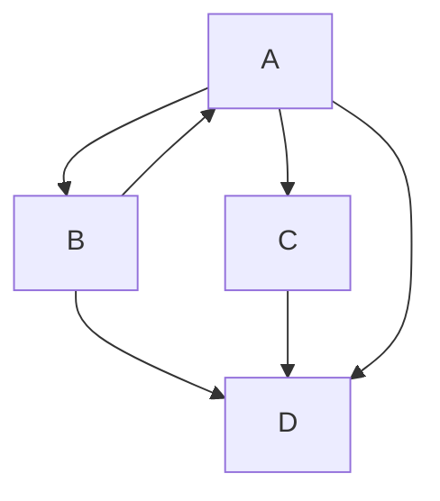
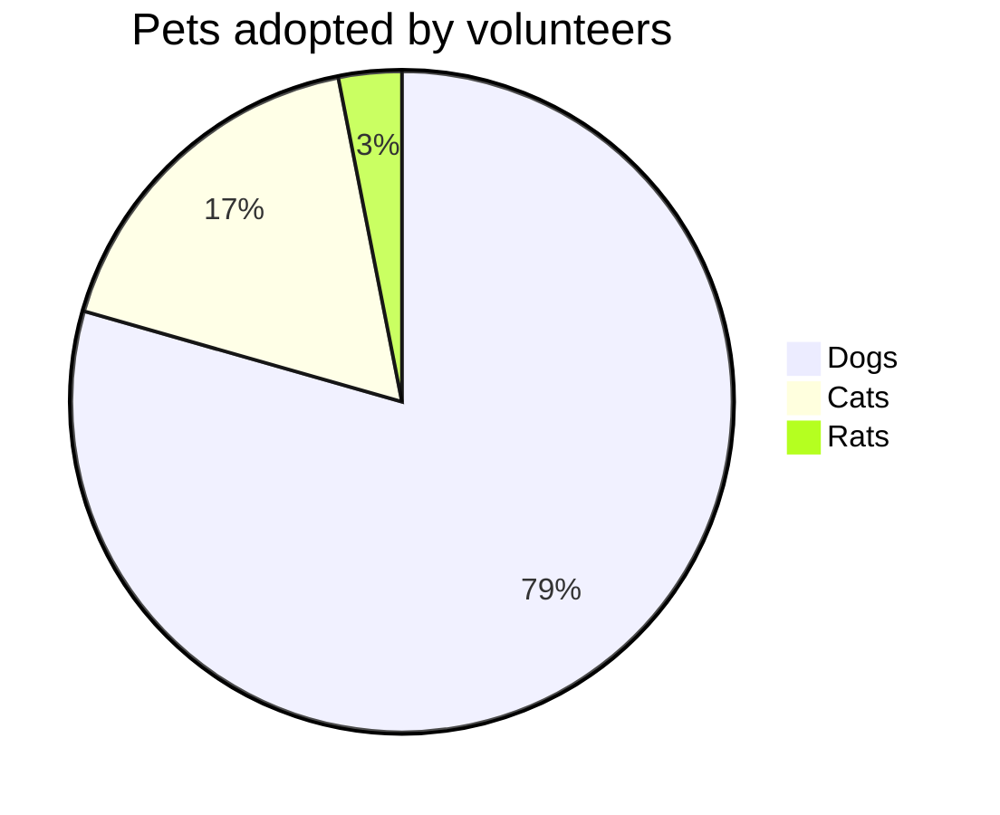
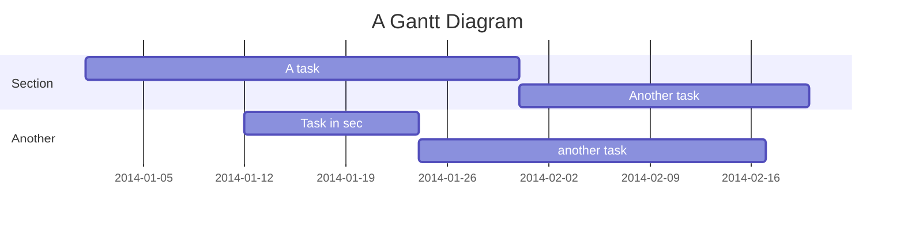

# Welcome

Metaspace is a virtual collaboration platform that runs in your browser. With Metaspace you can create your own 3D spaces with a single click. Invite others to join using a URL. No installation or app store required.

## Who is Metaspace for?

Metaspace is for anyone who wants to connect with others remotely! It's a great way to bring communities together in a shared virtual space.

Host a conference, teach a class, showcase art, or just hang out with friends. Metaspace makes it easy to connect and share images, videos, 3D models, and more. With Metaspace spatialized audio you can have conversations with everyone together or break out into smaller groups &mdash; just like you can in person.

Metaspace works across platforms. Got a VR headset? Awesome! If not, you can use your desktop computer, laptop, tablet, or mobile devices to explore in 2D

## Customizing Metaspace

Metaspace is open source and customizable. Upload or create unique environments using .

Want more control over your Metaspace interface? You can self-host your own version of the platform usin. Add custom branding, use your own domain name, limit access to approved users, and build your own features and functionality.

### What is Buidl?

is the built-in scene editor for creating environments that can be used in Metaspace. The editor runs entirely in the browser and allows you to upload your own 3D models, images, and files to use in your projects. Buidl also contains building kits and integrations with content providers to help you build the perfect space!
