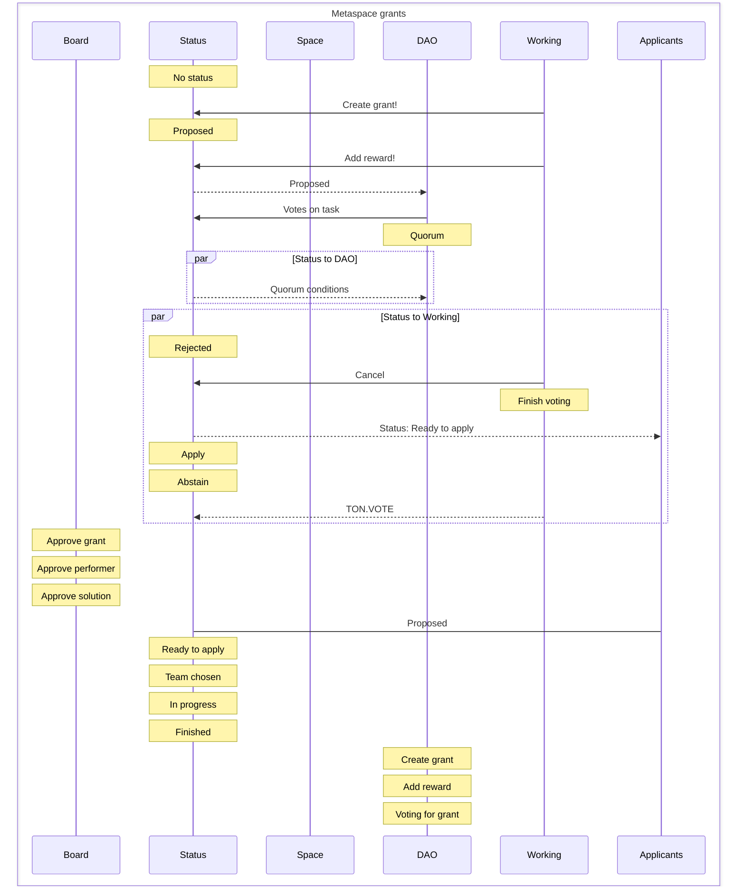

# Metaspace Ambassador Program

## What is the Program?

This program is meant to be enjoyable and not take up all your time. We want you to have fun and not worry about getting things done by a certain deadline. Instead, we want to recognize and reward you for the contributions you make to TON and Metaspace.

### 🙏 Open-Source

This is a way for people in the community to give [Donation](https://github.com/mir-one/donation) to the Metaspace and get rewarded for it. It's a way to encourage people to get involved and help with the things that TON needs and wants to achieve.

### Why does it exist?

The community is really important for Web3 businesses that work in a decentralized way. It's like a powerful tool that can help them do a lot of things. When many people in the community get involved and work together, they can achieve a lot more than just one person working alone. This is why having a big and active group of contributors can help any Web3 project succeed. Ambassador program wants to make it easier for people to join and be part of the TON community, and to help it grow and succeed.

| How?                                                                                                                                                                                                                                                                                                  | Why?                                                                                                                                                                                                                                                                                               |
| ----------------------------------------------------------------------------------------------------------------------------------------------------------------------------------------------------------------------------------------------------------------------------------------------------- | -------------------------------------------------------------------------------------------------------------------------------------------------------------------------------------------------------------------------------------------------------------------------------------------------- |
| 1. When someone needs help with something, they can post a "donation" with a description of what needs to be done, how much they will pay, and what needs to be achieved for the person to get the reward. The post will also include some goals that need to be met in order to get Donation Jetton. | This is a way to bring together all the different groups of people who are interested in TON, so they can work together and support each other. This is a group of people who want to help out with anything that needs to be done, no matter how big or small the task is.                        |
| 2. Ambassadors are people who want to help out, but they don't get paid for it. They look at the different bounties that are available and choose the ones that they can do best based on the goals and requirements that are listed.                                                                 | This is a way to get lots of volunteers to help build and make new Metaspace projects even better. It's like plugging in a bunch of helpers to make things happen faster and easier.                                                                                                               |
| 3. After the ambassadors finish the work they agreed to do, they turn it in so that someone can look at it and make sure it's done correctly.                                                                                                                                                         | This is a way for people who are really good at helping out and making a difference in the community to become leaders and help others do the same.                                                                                                                                                |
| 4. Oracles called "reviewers" check to make sure that the work the ambassadors did meets all the goals and requirements that were set. If it does, then the ambassador gets the reward that was promised.                                                                                             | Donation is a way to make sure that people who want to help out and make a difference can do so for a long time, and that they get rewarded for their contributions. It involves using special tools and ways of doing things to make sure that everyone can work together and make things happen. |
| 5. 🙏 It's really easy!                                                                                                                                                                                                                                                                               | [Code of Conduct](https://github.com/tonmetaspace/.github/blob/main/CODE_OF_CONDUCT.md)                                                                                                                                                                                                            |

# For everyone passionate about Metaspace and inspired by TON.

We invite you to contribute to the development and promotion of TON in the international arena.

### Theory

Theory and practice from Metaspace

### Make content

Documentation, instructions, manuals, localization, scientific papers,

### Communicate

Metaspace and offline (meetups, TONCon, social networks, collaborations)

### Get Rewards

`Donation` reward every day, additional bonuses and gifts for the TOP-100 ambassadors.

## How to become

### Metaspace makers

| What you may do                                               | How                                                                     |
| ------------------------------------------------------------- | ----------------------------------------------------------------------- |
| work with technical documentation, instructions and tutorials | make pull requests on GitHub for website                                |
| translate content into your native language                   | discuss what we need to translate in ambassador chat                    |
| make scientific papers based on TON technologies              | create video and text content, try to make it unique for your followers |
| popularize ideas of Metaspace                                 | share progress with other ambassadors and team                          |

### Community helpers

| What you may do                                                                                                           | How                                            |
| ------------------------------------------------------------------------------------------------------------------------- | ---------------------------------------------- |
| organize local offline meetups and hackathons based on Metaspace                                                          | make your suggestion in ambassador’s chat      |
| participate in thematic conferences on behalf of TONCon Metaspace                                                         | get merchandise if needed for offline events   |
| work online with community: online meetups and hackathons, chat administration, forum moderation, various social networks | share progress with other ambassadors and team |
| communicate with other projects for collaboration                                                                         |                                                |

# How

After you submit your application, please give us time to assign your application to a regional reviewer more appropriate for your time zone, as well as time to review your application. As soon as we complete our review, you will receive either an offer with a call to improve several areas before admission, or an invitation to an interview for further adaptation process.

> The number of participants in the program is limited by the number of available seats on one room of the Metaspace
